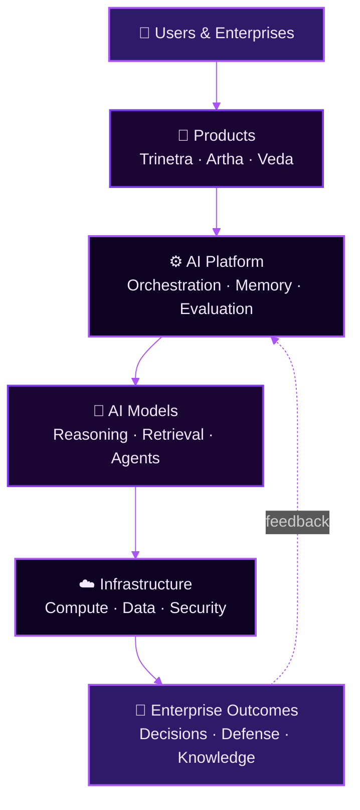

<div align="center">


<br/>


<br/><br/>


<br/>

<h3 align="center">Building AI-Native Infrastructure for the AGI Era</h3>

<br/>


<br/><br/>

<p>
  
  &nbsp;
  
  &nbsp;
  
</p>

<p align="center">
  
</p>

<p>
  <a href="https://rudrakshai.in"></a>
  &nbsp;
  <a href="mailto:support@rudrakshai.in"></a>
  &nbsp;
  
</p>

</div>

<br/>

<div align="center">

**‎**

</div>

---

<br/>

## 🌌&nbsp; Who We Are

Rudraksh AI is an **AI-native infrastructure company** building the intelligence layer for the next generation of enterprise software. We are not a single product, and we are not a single vertical — we are an **ecosystem of intelligent systems** designed to reason, decide, and act across the domains that matter most to modern organizations: security, business intelligence, and enterprise knowledge.

We exist because the software industry is undergoing its most significant architectural shift since the arrival of the cloud. Applications are no longer static tools that wait for instructions — they are becoming reasoning systems that understand context, make decisions, and act autonomously on behalf of the people and businesses that rely on them. Rudraksh AI was founded to build the infrastructure that makes this shift possible: durable, enterprise-grade, AI-native systems rather than thin wrappers around a single model.

Our long-term vision is simple to state and hard to build: a world where every enterprise workflow — from defending a network, to understanding a balance sheet, to searching an organization's collective knowledge — is powered by an intelligence layer that reasons the way a world-class expert would, at the speed and scale only software can provide.

**Why now?** Three forces have converged at the same moment — frontier reasoning models have crossed the threshold of genuine utility, enterprises are actively searching for AI-native partners rather than legacy vendors bolting AI onto old systems, and the cost of building serious AI infrastructure has fallen enough that a focused team can compete on the merit of its architecture rather than the size of its balance sheet. Rudraksh AI is built for this moment.

<br/>

---

<br/>

## 🎯&nbsp; Mission

<div align="center">

```
╔════════════════════════════════════════════════════════════════════╗
║                                                                      ║
║   To build the intelligence infrastructure that enterprises         ║
║   trust to reason, decide, and act — turning artificial              ║
║   intelligence from a feature into a foundation.                     ║
║                                                                      ║
╚════════════════════════════════════════════════════════════════════╝
```

</div>

We build systems, not demos. Every product in the Rudraksh AI ecosystem is designed to be dependable enough to sit at the center of an enterprise's operations — auditable, explainable, and built to earn trust incrementally rather than demand it upfront.

<br/>

---

<br/>

## 🔭&nbsp; Vision

We believe the companies that define the next decade of software will be **AI-native from the ground up** — not enterprises that added a chatbot, but organizations whose products reason as a first-class capability. Rudraksh AI is building toward that future across five fronts:

<table>
<tr>
<td width="50%" valign="top">

**🏢 AI-Native Enterprise**
Software built around reasoning and autonomy from day one, not retrofitted with a model call.

**👨‍💻 Developer Ecosystem**
SDKs, APIs, and documentation that let developers build on our intelligence layer instead of around it.

**🧠 Intelligence Infrastructure**
The durable layer of orchestration, memory, and evaluation that sits beneath every intelligent product we ship.

</td>
<td width="50%" valign="top">

**🧩 Reasoning Systems**
Systems that don't just retrieve information, but reason over it, weigh trade-offs, and justify conclusions.

**🖥️ The Future of Computing**
A shift from software you operate to software that operates alongside you — the autonomous systems era.

**♾️ The AGI Era**
We are building the infrastructure layer for that era responsibly — deliberately, and without overclaiming what exists today.

</td>
</tr>
</table>

<br/>

---

<br/>

## 🧬&nbsp; Product Ecosystem

<div align="center">
<h4>One company. One intelligence layer. Many products.</h4>
</div>

<br/>

<table>
<tr>
<td width="33%" valign="top">

### 🛡️ Trinetra
**AI Security Operations Platform**

An autonomous security layer that thinks like a red team and defends like a SOC.

- Autonomous Pentesting
- Threat Intelligence
- AI-Driven SOC
- Security Automation

<sub>Vertical: Cybersecurity</sub>

</td>
<td width="33%" valign="top">

### 📊 Artha
**AI Business Intelligence Platform**

Turns raw enterprise data into decisions, not just dashboards.

- Business Intelligence
- Data Intelligence
- Advanced Analytics
- Decision Intelligence

<sub>Vertical: Enterprise BI</sub>

</td>
<td width="33%" valign="top">

### 🧠 Veda
**Enterprise Knowledge Intelligence**

An organization's collective knowledge, made reasoned and searchable.

- Knowledge Graphs
- Enterprise Search
- Reasoning Engine
- AI Workspace

<sub>Vertical: Knowledge Systems</sub>

</td>
</tr>
</table>

<div align="center">

<br/>

**⚡ More products are in active development.**
<sub>Rudraksh AI is a multi-product ecosystem by design — new verticals are added as our intelligence layer matures.</sub>

</div>

<br/>

---

<br/>

## ⚙️&nbsp; Core Capabilities

<div align="center">
<table>
<tr>
<td align="center" width="25%">
<br/><b>🧠 Artificial Intelligence</b><br/><br/>
<sub>Foundational reasoning, planning, and decision systems</sub><br/><br/>
</td>
<td align="center" width="25%">
<br/><b>🤖 Autonomous AI Agents</b><br/><br/>
<sub>Agents that plan, execute, and self-correct on real tasks</sub><br/><br/>
</td>
<td align="center" width="25%">
<br/><b>☁️ Enterprise Infrastructure</b><br/><br/>
<sub>Scalable, secure backbone for AI-native products</sub><br/><br/>
</td>
<td align="center" width="25%">
<br/><b>📊 Business Intelligence</b><br/><br/>
<sub>Turning enterprise data into decision intelligence</sub><br/><br/>
</td>
</tr>
<tr>
<td align="center" width="25%">
<br/><b>🌐 Knowledge Intelligence</b><br/><br/>
<sub>Enterprise-wide reasoning over institutional knowledge</sub><br/><br/>
</td>
<td align="center" width="25%">
<br/><b>🛡️ AI Security</b><br/><br/>
<sub>Autonomous defense and offense-aware security tooling</sub><br/><br/>
</td>
<td align="center" width="25%">
<br/><b>🔧 Automation</b><br/><br/>
<sub>End-to-end workflow orchestration at enterprise scale</sub><br/><br/>
</td>
<td align="center" width="25%">
<br/><b>📦 Developer Platform</b><br/><br/>
<sub>APIs, SDKs, and tools to build on our intelligence layer</sub><br/><br/>
</td>
</tr>
</table>
</div>

<br/>

---

<br/>

## 🪷&nbsp; Philosophy

**Why an ecosystem, not a single product?**
Enterprise intelligence is not one problem — it's dozens of interconnected ones. A company defending its network, understanding its revenue, and searching its own knowledge base are solving different surface problems with the same underlying need: reasoning over complex, high-stakes information. Building an ecosystem lets us solve that need once, at the infrastructure layer, and express it across every product.

**Why AI-native, not AI-added?**
Bolting a model onto legacy software produces a feature. Designing a product around reasoning from its first line of code produces a platform. Rudraksh AI's products are architected around intelligence as the core primitive — not a chatbot in the corner of an existing tool.

**Why infrastructure first?**
Products change. Markets shift. Infrastructure — the orchestration, evaluation, memory, and safety layers beneath every product — is what compounds. We invest disproportionately here because it is what lets Trinetra, Artha, Veda, and everything that follows share a single, ever-improving intelligence core.

**Why an intelligence layer, not just an application layer?**
Applications solve a single workflow. An intelligence layer solves the underlying reasoning problem that many workflows share. We build at the layer that lets one investment serve many products, many industries, and many years.

<br/>

---

<br/>

## 🏗️&nbsp; Architecture

<div align="center">



</div>

At the top, users and enterprises interact with our products. Every product is built on a shared **AI Platform** — the orchestration, memory, and evaluation layer that is Rudraksh AI's core intellectual property. That platform draws on a mix of **AI models**, both proprietary and frontier third-party models, deployed over infrastructure engineered for enterprise-grade reliability and security. The result flows back to enterprises as decisions, defense, and knowledge — and their outcomes feed back into the platform, continuously improving it.

<br/>

---

<br/>

## 🛠️&nbsp; Technology

<div align="center">

**Languages**
<br/>


<br/><br/>

**Frameworks**
<br/>


<br/><br/>

**AI & Machine Learning**
<br/>


<br/><br/>

**Cloud & Infrastructure**
<br/>


<br/><br/>

**Databases**
<br/>


<br/><br/>

**Developer Tools & Platforms**
<br/>


<br/><br/>

**Compute**
<br/>


</div>

<br/>

---

<br/>

## 📖&nbsp; Open Source

Rudraksh AI does not open-source its proprietary reasoning systems, product internals, or model weights — these represent our core intellectual property and enterprise trust commitments.

What we **do** open-source, deliberately and generously:

<div align="center">
<table>
<tr>
<td width="50%" valign="top">

- 📚 **Documentation** — architecture guides, product docs, integration walkthroughs
- 🧰 **SDKs** — official client libraries for our public APIs
- 🧪 **Examples** — working reference implementations
- 📦 **Libraries** — general-purpose tools built along the way

</td>
<td width="50%" valign="top">

- 🔬 **Research** — publications and write-ups from our applied research work
- 🛠️ **Developer Tools** — utilities that make building on our platform easier
- 🌍 **Community Resources** — guides, templates, and learning material
- 🗺️ **Public Roadmap** — visibility into where the ecosystem is headed

</td>
</tr>
</table>
</div>

<br/>

---

<br/>

## 📂&nbsp; Public Repositories

<div align="center">

| Repository | Purpose |
|---|---|
| **`.github`** | Organization-wide health files, templates, and this README |
| **`docs`** | Central documentation hub for the entire Rudraksh AI ecosystem |
| **`trinetra-docs`** | Public documentation for the Trinetra AI Security Operations Platform |
| **`artha-docs`** | Public documentation for the Artha AI Business Intelligence Platform |
| **`veda-docs`** | Public documentation for the Veda Enterprise Knowledge Intelligence platform |
| **`sdk-python`** | Official Python SDK for the Rudraksh AI platform APIs |
| **`sdk-js`** | Official JavaScript/TypeScript SDK for the Rudraksh AI platform APIs |
| **`api-examples`** | Reference implementations and integration examples |
| **`awesome-ai`** | A curated list of AI-native tools, papers, and resources |
| **`security-research`** | Public security research, advisories, and write-ups from our team |
| **`public-roadmap`** | Transparent, versioned roadmap for our product ecosystem |
| **`brand-assets`** | Official Rudraksh AI logos, colors, and brand guidelines |

</div>

<br/>

---

<br/>

## 💎&nbsp; Why Rudraksh AI

<div align="center">
<table>
<tr>
<td align="center" width="16.6%"><br/>🚀<br/><b>Innovation</b><br/><sub>First-principles product design</sub><br/><br/></td>
<td align="center" width="16.6%"><br/>🧠<br/><b>AI-Native</b><br/><sub>Reasoning as a core primitive</sub><br/><br/></td>
<td align="center" width="16.6%"><br/>🏢<br/><b>Enterprise-Ready</b><br/><sub>Built for trust at scale</sub><br/><br/></td>
<td align="center" width="16.6%"><br/>👨‍💻<br/><b>Developer-First</b><br/><sub>APIs and SDKs from day one</sub><br/><br/></td>
<td align="center" width="16.6%"><br/>📈<br/><b>Scalable</b><br/><sub>Infrastructure that compounds</sub><br/><br/></td>
<td align="center" width="16.6%"><br/>🔬<br/><b>Research-Driven</b><br/><sub>Grounded in applied research</sub><br/><br/></td>
</tr>
</table>
</div>

<br/>

---

<br/>

## 🗺️&nbsp; Roadmap

<div align="center">

### 2026
**Foundations & Launch**

`Trinetra Launch` · `Public API` · `SDK Release (Python & JS)` · `Developer Platform`

<br/>

### 2027
**Expansion & Enterprise Scale**

`Artha Launch` · `Veda Launch` · `Enterprise Platform` · `Cloud Infrastructure` · `Reasoning Platform`

</div>

<sub>Roadmap items reflect current intent and are subject to change as our research and enterprise partnerships evolve.</sub>

<br/>

---

<br/>

## 🟢&nbsp; NVIDIA Inception Program

<div align="center">


</div>

Rudraksh AI is a proud member of the **NVIDIA Inception Program**, a global initiative supporting cutting-edge startups building on GPU-accelerated computing. This membership connects our team with:

- ⚡ **GPU Computing Resources** — accelerated infrastructure for training and inference
- 🧠 **AI Innovation Support** — technical guidance from NVIDIA's AI ecosystem
- 🏢 **Enterprise AI Best Practices** — shared learnings from NVIDIA's global partner network
- 🚀 **Acceleration** — go-to-market and technical resources to scale faster

<br/>

---

<br/>

## 📚&nbsp; Documentation

<div align="center">

<a href="https://rudrakshai.in"></a>
&nbsp;
<a href="https://github.com/rudraksh-ai"></a>
&nbsp;
<a href="https://rudrakshai.in/docs"></a>

<br/><br/>

<a href="https://rudrakshai.in/api"></a>
&nbsp;
<a href="https://rudrakshai.in/blog"></a>

</div>

<br/>

---

<br/>

## 🌍&nbsp; Community

Rudraksh AI's ecosystem is built with, and for, the people pushing AI-native software forward:

<div align="center">
<table>
<tr>
<td align="center" width="20%"><br/>👨‍💻<br/><b>Developers</b><br/><sub>Building on our SDKs & APIs</sub><br/><br/></td>
<td align="center" width="20%"><br/>🔬<br/><b>Researchers</b><br/><sub>Advancing applied AI research</sub><br/><br/></td>
<td align="center" width="20%"><br/>🎓<br/><b>Students</b><br/><sub>Learning AI-native engineering</sub><br/><br/></td>
<td align="center" width="20%"><br/>🤝<br/><b>Contributors</b><br/><sub>Improving our open-source work</sub><br/><br/></td>
<td align="center" width="20%"><br/>🏢<br/><b>Partners</b><br/><sub>Building the ecosystem with us</sub><br/><br/></td>
</tr>
</table>
</div>

<br/>

---

<br/>

## 🤝&nbsp; Contribution

We welcome contributions across our open-source repositories — documentation, SDKs, examples, and community resources.

1. **Fork** the relevant repository
2. **Create a branch** for your change (`feature/your-feature` or `fix/your-fix`)
3. **Follow existing style and structure** so reviews stay fast
4. **Write clear commits** describing the *why*, not just the *what*
5. **Open a pull request** with context on what changed and why
6. **Engage in review** — we aim to respond promptly and constructively

For substantial changes, please open an issue first to discuss direction before investing significant time. Security-related findings should go through our responsible disclosure process rather than a public issue — see `security-research` for details.

<br/>

---

<br/>

## 📬&nbsp; Contact

<div align="center">

<a href="https://rudrakshai.in"></a>
&nbsp;
<a href="mailto:support@rudrakshai.in"></a>

<br/><br/>

<a href="https://www.linkedin.com/company/rudraksh-ai/"></a>
&nbsp;
<a href="https://www.instagram.com/rudraksh_ai/"></a>
&nbsp;
<a href="https://www.youtube.com/@rudrakshai"></a>
&nbsp;
<a href="https://github.com/rudraksh-ai"></a>

</div>

<br/>

---

<br/>

<div align="center">


<br/>

<sub>© 2026 Rudraksh AI &nbsp;·&nbsp; प्रज्ञा अस्ति संरक्षणम् &nbsp;·&nbsp; <a href="mailto:support@rudrakshai.in">support@rudrakshai.in</a></sub>

</div>
